# QACaseStudy-SwissMedicalApp
Proyecto de QA Testing Manual: Análisis de usabilidad, diseño de matriz de pruebas y reporte de bugs para la aplicación de Swiss Medical.

## 📋 Descripción del Proyecto
Este proyecto consiste en una auditoría de calidad de software e iniciativa propia 
realizada sobre la aplicación móvil oficial de **Swiss Medical** (Versiones 4.0.59 y 
4.0.60) para Android. El objetivo principal fue evaluar el flujo crítico de gestión y 
reserva de turnos médicos bajo la perspectiva de un QA Tester, buscando asegurar la 
robustez funcional y una experiencia de usuario (UX) sin fricciones.

## 🛠️ Alcance y Enfoque del Testing
Se diseñó y ejecutó una estrategia basada en tres pilares esenciales:
* **Testing Funcional (Black Box):** Validación de reglas de negocio en los límites 
del sistema.
* **Testing de Usabilidad:** Evaluación de los flujos de interacción y la claridad de 
los mensajes del sistema.
* **Testing Manual Exploratorio:** Simulación de escenarios reales de usuarios de 
alta frecuencia.
**Entorno de Pruebas:**
* **Dispositivo:** Dispositivo Móvil Android 13
* **Versiones Evaluadas:** 4.0.59 y 4.0.60
* **Fecha de Ejecución:** Mayo 2026

## 📊 Matriz de Casos de Prueba Ejecutados

A continuación, se detalla el diseño y la ejecución de los escenarios clave para validar las reglas de negocio en el módulo de turnos:

| ID | Funcionalidad | Objetivo | Pasos | Resultado esperado | Resultado obtenido | Estado |
| :--- | :--- | :--- | :--- | :--- | :--- | :---: |
| **TC-01** | Gestión de turnos | Validar que el sistema permita reservar un turno si el usuario tiene menos del límite máximo (3 turnos activos) en la misma especialidad. | 1) Iniciar sesión con cuenta que posea hasta 2 turnos activos en una misma categoría. 2) Ir a "Solicitud de Turnos". 3) Seleccionar la misma categoría. 4) Elegir un turno disponible y presionar "Confirmar". | El sistema confirma la reserva con éxito y muestra el comprobante del 3º turno activo. | El turno se gestionó correctamente y se visualiza en la agenda. | **Exitoso ✔️** |
| **TC-02** | Gestión de turnos | Validar el comportamiento del sistema cuando el usuario intenta reservar un 4º turno activo, superando el límite permitido por la regla de negocio. | 1) Iniciar sesión con cuenta que posea 3 turnos activos en una misma categoría. 2) Ir a "Solicitud de Turnos". 3) Seleccionar la misma categoría. 4) Elegir un turno disponible y presionar "Confirmar". | El sistema debe advertir claramente que se alcanzó el límite máximo de 3 turnos para esa especialidad. | Muestra un mensaje genérico: *"Ocurrió un error al gestionar el turno. Por favor, intentalo de nuevo más tarde"*. | **Fallido ❌** |

## 🐛 Defectos Críticos Detectados (Bug Report)

### Bug #1: Ausencia de Feedback Informativo ante Restricción de Negocio (Límite de 
Turnos)
* **Prioridad:** Media | **Severidad:** Media
* **Componente:** Módulo de Confirmación de Turnos (Global)
**Descripción:**
Al intentar reservar un cuarto (4°) turno activo dentro de una misma especialidad, la 
aplicación permite visualizar la disponibilidad y avanzar hasta el último paso. Sin 
embargo, al confirmar, el sistema falla mostrando un mensaje genérico: *"Ocurrió un 
error al gestionar el turno. Por favor, intentalo de nuevo más tarde"*, en lugar de 
notificar el límite real de la regla de negocio.

**Pasos para Reproducir:**
1. Iniciar sesión con una cuenta que posea 3 turnos activos en una misma categoría 
(ej: Odontología General).
2. Dirigirse a la sección de "Solicitud de Turnos".
3. Seleccionar la misma categoría con turnos al límite.
4. Seleccionar un turno libre disponible y presionar "Confirmar".
5. Observar el mensaje emergente de error obtenido.
   
**Resultado Esperado:**
El sistema debe realizar una validación temprana (bloquear la categoría o advertir 
con claridad) o, en su defecto, lanzar un mensaje informativo preciso: *"Has 
alcanzado el límite máximo de 3 turnos activos para esta especialidad."*

**Resultado Actual:**
Se muestra una alerta que simula una caída del servidor o error técnico temporal, 
induciendo al usuario a reintentar indefinidamente un flujo bloqueado por diseño.

### 📸 Evidencias del Testing y Defectos Detectados

Para demostrar la consistencia de los resultados, las pruebas se ejecutaron en dos especialidades médicas diferentes (Odontología y Ginecología), validando tanto el comportamiento correcto (Caso Feliz) como el comportamiento erróneo al superar el límite.

Haz clic en cada sección para desplegar las capturas de pantalla correspondientes:

#### 🦷 Caso 1: Especialidad Odontología

<b>🟢 Ver Evidencias: Caso Exitoso </b>

Estas capturas muestran el flujo correcto cuando el usuario se encuentra dentro del límite permitido de la regla de negocio y el sistema confirma el turno con éxito.

1. **Paso 1:** Se muestra los turnos activos en la especialidad Odontología.
   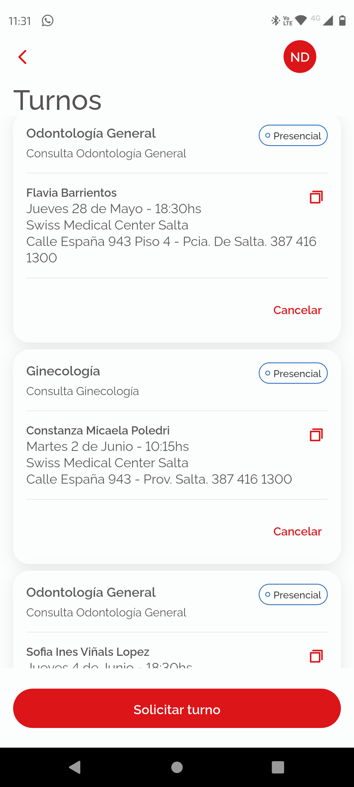
2. **Paso 2:** Selección de categoría, fecha y profesional disponible.
   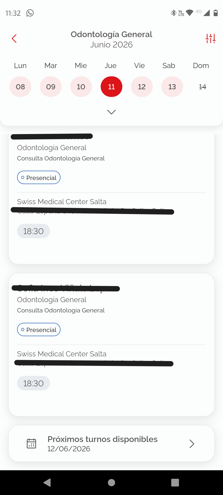
   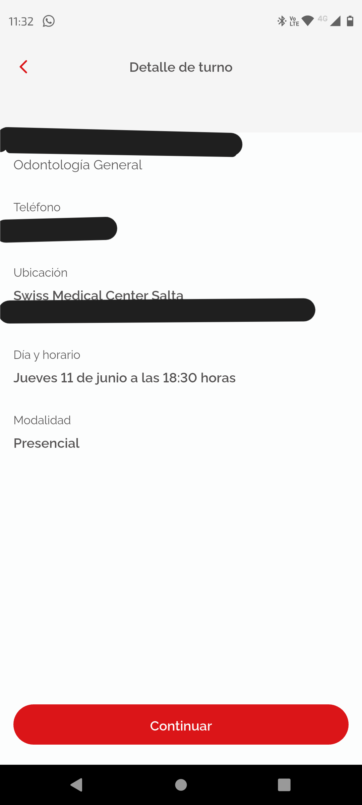
3. **Paso 3:** Confirmación exitosa del tercer turno en la agenda.
   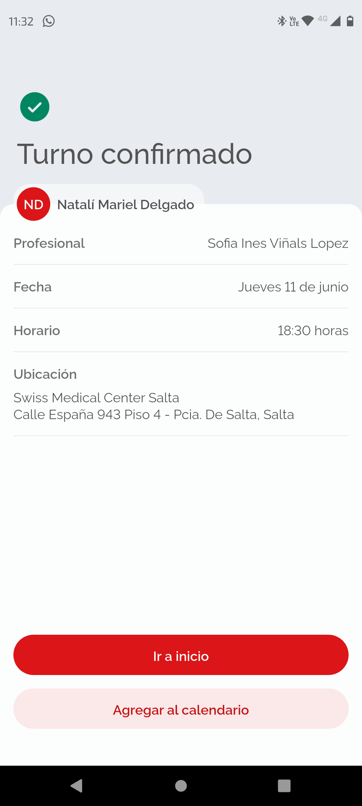

<b>🔴 Ver Evidencias: Caso Fallido / Bug (Intento de 4º turno)</b>

Aquí se observa cómo el sistema permite avanzar en todo el flujo, pero al confirmar el cuarto turno, bloquea al usuario con un mensaje de error técnico impreciso.

1. **Paso 1:** Se muestra los turnos activos en la especialidad Odontología.
   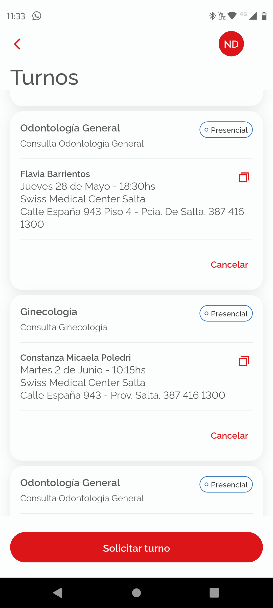
   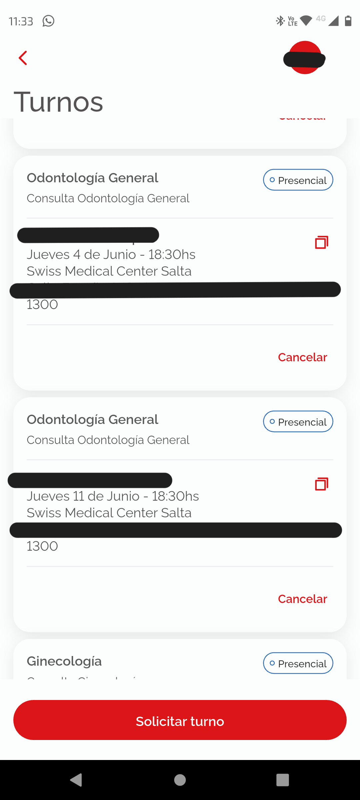
2. **Paso 2:** Selección de categoría, fecha y profesional disponible.
   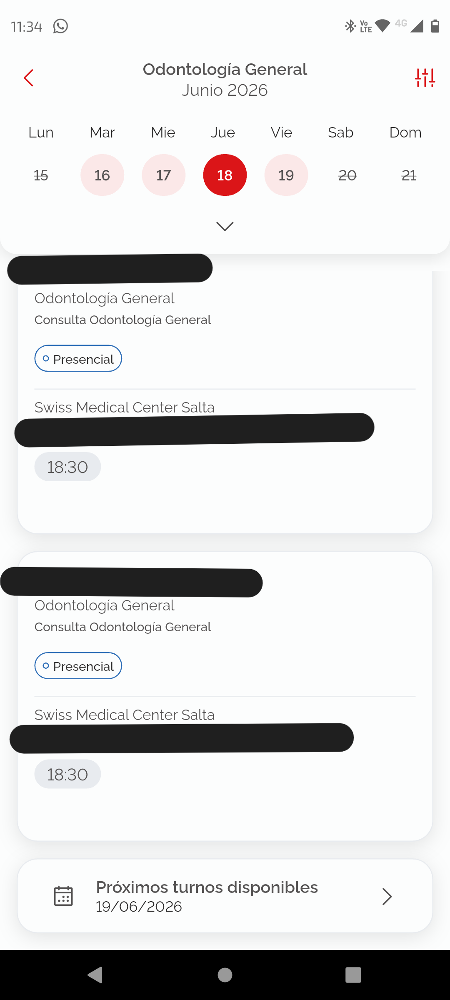
3. **Paso 3:** Mensaje de error genérico obtenido al confirmar ("Ocurrió un error al gestionar el turno...").
   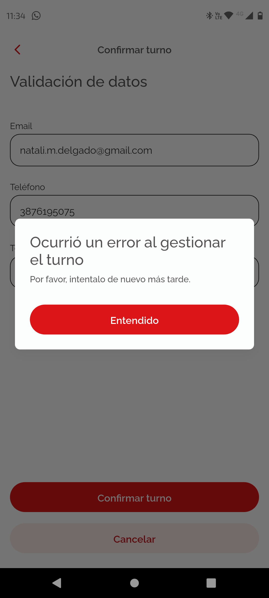

---

#### 🤰 Caso 2: Especialidad Ginecología

<b>🟢 Ver Evidencias: Caso Exitoso </b>

Validación del flujo correcto en una segunda categoría para asegurar la consistencia del sistema.

1. **Paso 1:** Se muestra los turnos activos en la especialidad Ginecología.
   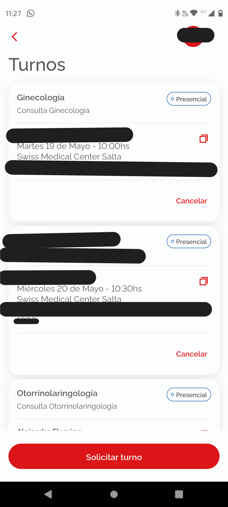
   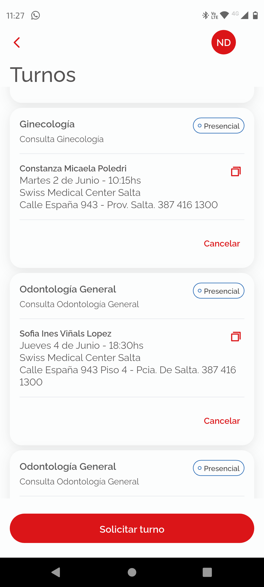
2. **Paso 2:** Selección de categoría, fecha y profesional disponible.
   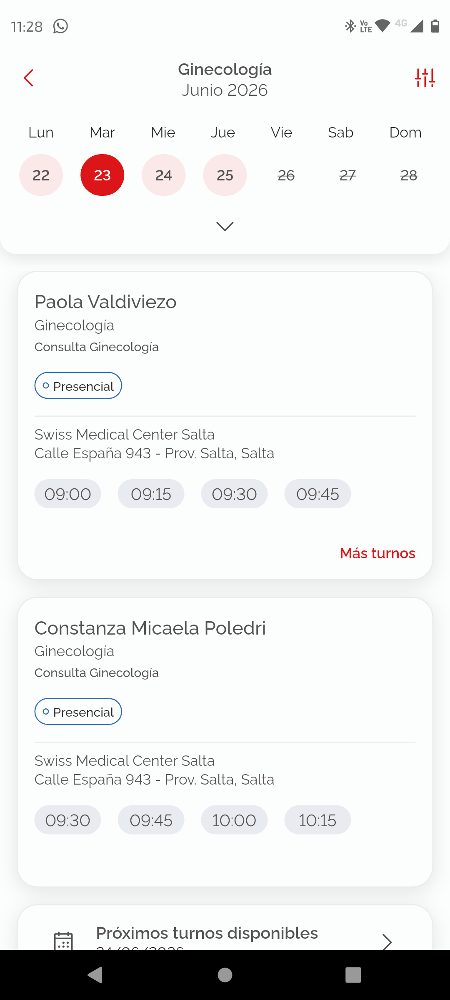
   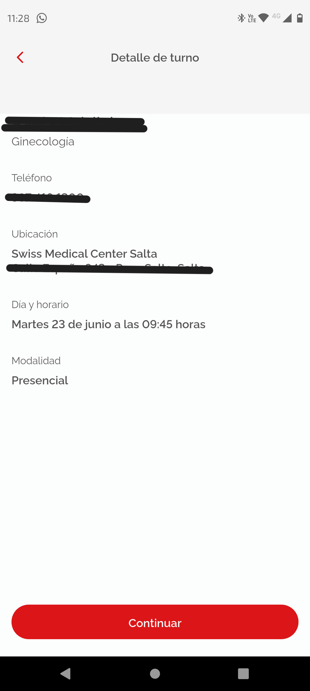
3. **Paso 3:** Confirmación exitosa del turno.
   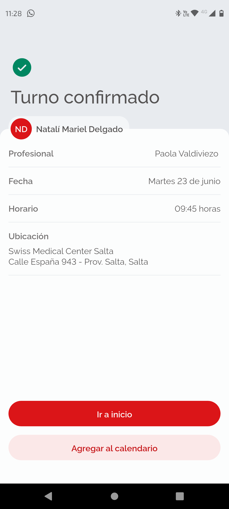

<b>🔴 Ver Evidencias: Caso Fallido / Bug (Intento de 4º turno)</b>

Evidencia que confirma que el bug de la falta de feedback informativo se replica de forma idéntica en el módulo de Ginecología.

1. **Paso 1:** Se muestra los turnos activos en la especialidad Ginecología.
   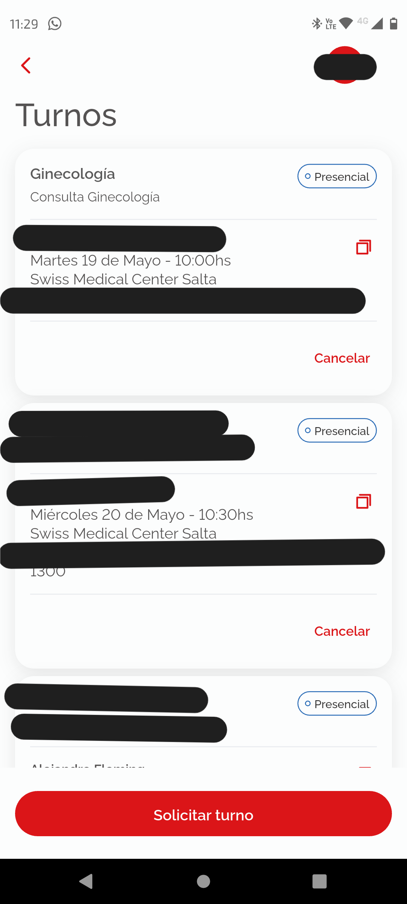
   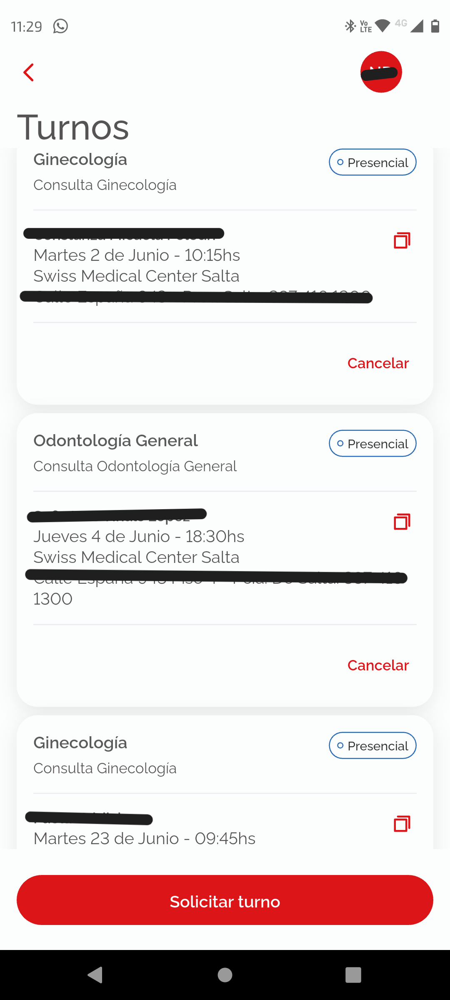
2. **Paso 2:** Selección de categoría, fecha y profesional disponible.
   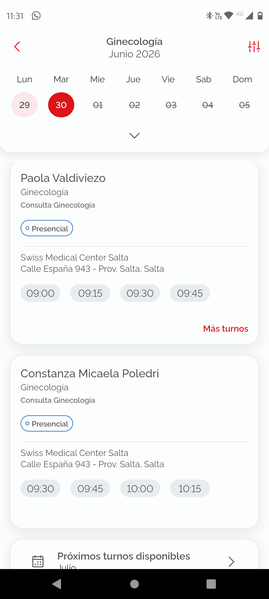
   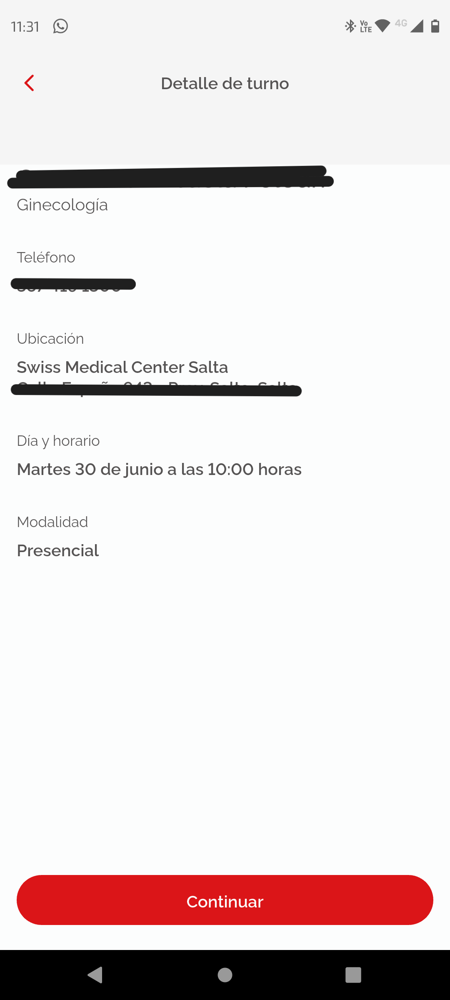
3. **Paso 3:** Aparición de la misma alerta genérica simulando caída del sistema.
   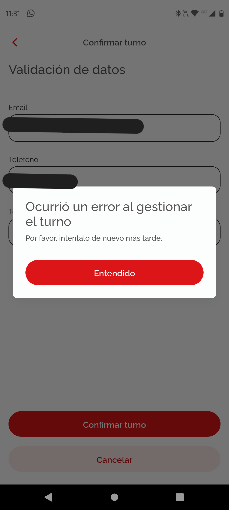

---

## 📈 Impacto en el Negocio y Soluciones Sugeridas

Como QA, el análisis no se limita a reportar la falla técnica, sino a entender cómo afecta este comportamiento al usuario y al negocio, proponiendo mejoras viables para el equipo de desarrollo.

### ⚠️ Análisis de Impacto (Negocio y UX)

* **Fricción y frustración del usuario:** Al recibir un mensaje que dice *"Por favor, intentalo de nuevo más tarde"*, el usuario asume de forma natural que la aplicación anda mal o que los servidores de la prepaga están caídos. Esto genera que reintente el flujo múltiples veces, generando frustración.
* **Saturación innecesaria de la API:** Cada reintento del usuario genera peticiones HTTP basura hacia el servidor, consumiendo recursos de infraestructura de forma totalmente evitable.
* **Sobrecarga en canales de soporte:** Al no poder resolver la gestión por la app y creer que es un error del sistema, los usuarios tienden a llamar al Call Center o dejar calificaciones negativas (1 estrella) en la Google Play Store, afectando la reputación digital de Swiss Medical.

### 🛠️ Soluciones Técnicas Propuestas

Para solucionar este problema de raíz y mejorar la experiencia, se sugieren dos enfoques complementarios:

| Capa del Sistema | Solución Sugerida |
| :--- | :--- |
| **Front-End (Aplicación Móvil)** | **Validación preventiva:** El sistema debería conocer de antemano cuántos turnos activos tiene el usuario en esa categoría. Si el contador es igual a 3, se debería mostrar un banner informativo antes de iniciar el flujo, evitando que el usuario pierda tiempo buscando disponibilidad. |
| **Back-End (API / Servidor)** | **Refactorización de Códigos de Respuesta:** La API no debe responder con un error genérico (ej. 500 Internal Server Error). Debe devolver un código controlado acompañado de un mensaje claro en el JSON (ej. `limite_turnos_excedido`), para que la aplicación móvil pueda interpretar esa respuesta y mostrar en pantalla el mensaje correcto: *"Has alcanzado el límite máximo de 3 turnos activos para esta especialidad."* |

